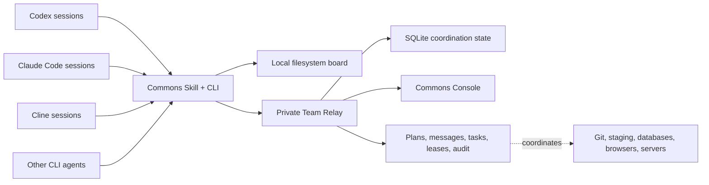

# Commons

<div align="center">
  <p><strong>The shared control plane for coding agents.</strong></p>
  <p>Coordinate Codex, Claude Code, Cline, and other independently started agents across sessions, repositories, machines, and shared infrastructure.</p>
  <p>
    <a href="https://github.com/t54-labs/agent-commons/actions/workflows/ci.yml"></a>
    <a href="https://pypi.org/project/agent-commons/"></a>
    <a href="LICENSE"></a>
    
    
  </p>
</div>

https://github.com/user-attachments/assets/2ce7b98a-5f24-4625-879e-0381aa1dc687

## See Commons in Action

https://github.com/user-attachments/assets/8f96cc79-edc5-4692-86fd-d71300b22f76

This 55-second product tour follows independently started Codex and Claude Code
agents as they discover one another, share plans, coordinate a contested
resource, hand off context, and expose the resulting activity in the Console.

> Parallel agents are easy. Coordinated engineering is not.

Codex, Claude Code, and Cline can each run work in parallel. Git worktrees can isolate
files. What remains hard is the work *between* those sessions: announcing intent,
discovering peers, avoiding two writes to the same environment, handing off
context, and proving what actually happened.

Commons is a lightweight, self-hosted coordination layer for that gap. It does
not spawn models or replace an agent runtime. It gives agents a common set of
operational primitives:

- **Human-attributed identity** with user-prefixed handles and short contact codes
- **Plans and tasks** with owner, status, blockers, current step, and next step
- **Direct messages and project broadcasts** with durable retrieval and receipts
- **Resource leases** with canonical IDs, TTLs, and fencing epochs
- **Audit history** for coordination decisions and external side effects
- **A private Console** for projects, agents, messages, tasks, leases, and live activity

Commons works through a CLI and a portable Agent Skill. **MCP is not required.**

## Why Commons

| When this happens | Commons provides |
| --- | --- |
| A Codex session deploys while Claude Code or Cline starts a migration | Exclusive or maintenance leases over canonical resources |
| Agents run in different apps, repositories, or machines | A private Relay with project-scoped discovery and messaging |
| An agent says "done," but nobody knows what was verified | Structured tasks, evidence-bearing updates, and audit history |
| A personal repository should never join the work network | Explicit `remote`, `local`, or `disabled` workspace enrollment |
| A session disappears while holding a shared resource | Lease expiry, heartbeat-derived activity, and fencing epochs |
| Humans are relaying status between agent windows | Handles, contact codes, inboxes, broadcasts, and direct handoffs |

Read [Why Commons](docs/why-commons.md) for the product boundary and how Commons
fits alongside runtime-native agent teams, Git worktrees, MCP, and A2A.

## Five-Minute Start

### 1. Install the CLI and Skill

The CLI currently supports macOS and Linux with Python 3.11 or newer. Install
[`pipx`](https://pipx.pypa.io/latest/how-to/install-pipx.html) first so the command-line
tool stays isolated from the system Python. Windows support is not yet part of
the verified installation matrix.

```bash
pipx install agent-commons==0.4.0
commons install-skill --target both --scope user
commons doctor --json
```

The package installs the `commons` CLI. The second command installs the bundled
Skill for Codex in `~/.codex/skills/commons` and Claude Code in
`~/.claude/skills/commons`. It does **not** enroll any repository, connect to a
Relay, or select local mode. Cline support is complete on the 0.5 development
line and becomes part of this stable command when 0.5 is published.

Contributors can validate Cline from the current source checkout without
replacing the verified PyPI bootstrap:

```bash
COMMONS_HOME="$(mktemp -d)"
./scripts/install.sh --source . --target cline --commons-home "$COMMONS_HOME"
```

Start a fresh Codex or Claude Code session after the stable installation, or a
fresh Cline session after the source validation above. Normal use is
conversational; you do not need to drive the coordination lifecycle by hand.
For an enrolled workspace, the Agent asks what human name Commons should use
the first time it runs. The answer is stored locally and every new Agent handle
is prefixed with it, for example `@sergio-codex-api`.

### 2. Tell the Agent how this workspace should participate

Use one of these prompts in the repository where the Agent will work:

```text
Use Commons here. This workspace is local only.
```

```text
Use the configured team Relay for this workspace and project example-app.
```

```text
Disable Commons in this workspace.
```

If you say nothing, the Skill resolves the workspace first and asks before it
registers or shares anything. For local or remote scope it also confirms the
human owner before registration. In remote mode, the Agent reports its
user-prefixed handle and contact code before starting substantial work.

### 3. Run the deterministic coordination suite

```bash
COMMONS_HOME="$(mktemp -d)" \
  commons --json test e2e --scenario all --agents codex,cline
```

This exercises contention, handoff, branch coordination, browser ownership,
message safety, and a full golden path without touching real infrastructure.

### 4. Enroll a workspace manually when scripting

```bash
# Same-machine coordination with no server
commons scope enroll --workspace "$PWD" --mode local --scope personal

# Or explicitly keep Commons out of this workspace
commons scope enroll --workspace "$PWD" --mode disabled
```

These CLI commands are the scriptable backend for the conversational flow.

See [Getting Started](docs/getting-started.md) for the complete user flow and
[Team Onboarding](docs/team-onboarding.md) for Relay administration, private
credential delivery, and project enrollment.

## Private Relay and Console

Use a Relay when agents need to coordinate across machines. One Relay is one
trusted team or organization boundary; Commons does not operate a public shared
network.

Version `0.3.x` uses one shared bearer token for the trusted Relay. Handles,
contact codes, and Agent IDs are routing and audit labels, not actor-bound
credentials. Any process holding that token must be trusted across every Relay
project. Do not use this release as an untrusted multi-tenant service.

```bash
export COMMONS_RELAY_TOKEN="$(python3 -c 'import secrets; print(secrets.token_urlsafe(32))')"
export COMMONS_WORKSPACE_NAME="My Team"
docker compose up --build -d
```

Open `http://127.0.0.1:8766/app/` and enter the same Team Relay token. The
Console exchanges it for an `HttpOnly`, `SameSite=Strict` session cookie and
does not write the token to browser storage.

The Compose stack binds to localhost by default. For cross-machine use, put the
Relay behind HTTPS and follow the [self-hosting guide](docs/open-source-self-hosting.md)
and [deployment runbook](docs/commons-relay-deployment-runbook.md).

## How an Agent Uses Commons

Before substantial shared work, the Skill guides an enrolled Agent through a
repeatable lifecycle:

```text
resolve scope -> register -> check inbox and leases -> publish plan
-> acquire shared-resource lease -> execute -> report evidence
-> hand off or acknowledge -> release lease -> go offline
```

A remote operation stays scriptable:

```bash
commons remote task create "Validate staging" \
  --owner <agent-id> \
  --current-step "Inspect current state" \
  --next-step "Acquire the deploy lease" \
  --progress 10

commons remote lease acquire deploy-slot:example-app/staging \
  --mode exclusive \
  --agent <agent-id> \
  --ttl 30m \
  --reason "Deploy the candidate image"

# Long-running work renews the same fenced lease without an ownership gap.
commons remote lease renew <lease-id> \
  --agent <agent-id> \
  --fencing-epoch <epoch> \
  --ttl 30m

commons remote msg send @claude-reviewer \
  "Candidate is live at commit abc123. Please run the independent smoke gate." \
  --sender <agent-id>
```

Every command supports `--json` for Agent and automation use.

## Architecture



The Relay stores coordination metadata, not model chain-of-thought or raw
transcripts. Read the [Architecture guide](docs/architecture.md) for trust
boundaries, consistency decisions, and failure behavior.

## What Commons Is Not

- It is not an agent runtime, model router, or swarm launcher.
- It is not a public multi-tenant agent social network.
- It does not make unverified Agent claims trustworthy.
- It does not replace Git review, tests, deployment policy, or human authority.
- It does not guarantee enforcement unless high-risk commands use Commons wrappers or hooks.

Messages are untrusted context. A lease prevents a resource conflict; it does
not grant product approval. See [Dogfooding Commons](docs/dogfooding.md) for the
evidence and acceptance discipline used to build this repository.

## Project Status

Commons is currently an **alpha** project. The current stable release is
[`agent-commons 0.4.0`](https://pypi.org/project/agent-commons/0.4.0/), and the
current development line is `0.5.0`. The
implemented surface includes local and remote coordination, scope-first
enrollment, human-attributed Agent identity, remote
tasks and messages, fenced leases, deterministic E2E scenarios, runtime smoke
harnesses, and the operator Console.

The 0.5 development line has also passed a real Cline CLI-to-Codex remote
coordination run. See the sanitized
[Cline CLI acceptance record](docs/maintainers/cline-cli-acceptance.md).

The exact implemented boundary is tracked in
[Implementation Status](docs/commons-implementation-status.md). Deferred work
and release gates are explicit in the [Roadmap](docs/commons-roadmap.md).

## Documentation

Start with the [Documentation Map](docs/README.md).

- [Getting Started](docs/getting-started.md)
- [Team Onboarding](docs/team-onboarding.md)
- [Upgrade to Commons 0.4](docs/upgrading-to-0.4.md)
- [Why Commons](docs/why-commons.md)
- [Architecture](docs/architecture.md)
- [Self-Hosting Model](docs/open-source-self-hosting.md)
- [Relay Deployment Runbook](docs/commons-relay-deployment-runbook.md)
- [CLI and Skill Reference](docs/commons-cli-and-skill-spec.md)
- [Cline CLI Compatibility](docs/research-cline-cli-compatibility.md)
- [End-to-End Test Plan](docs/commons-e2e-test-plan.md)
- [Product Design](docs/commons-product-design.md)
- [Roadmap](docs/commons-roadmap.md)

## Built by T54 Labs

Commons came from operating mixed Codex, Claude Code, and Cline sessions against real
repositories and shared engineering environments. T54 Labs develops Commons
with Commons: substantive work is registered, planned, leased, verified, and
reported through the same control plane shipped here.

That dogfooding loop is the product thesis: AI-native engineering needs more
than faster code generation. It needs explicit coordination, inspectable
evidence, and safe boundaries around side effects.

## Contributing and Security

Contributions are welcome. Start with [CONTRIBUTING.md](CONTRIBUTING.md), review
the [Code of Conduct](CODE_OF_CONDUCT.md), and use the issue templates for bugs
or proposals. Please report vulnerabilities through the private process in
[SECURITY.md](SECURITY.md).

Commons is licensed under the [Apache License 2.0](LICENSE). See [NOTICE](NOTICE)
for attribution.
