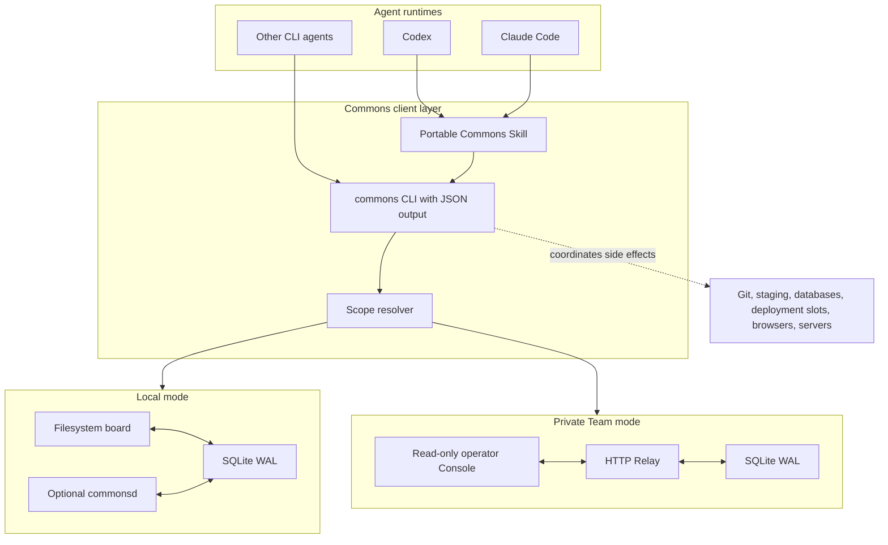
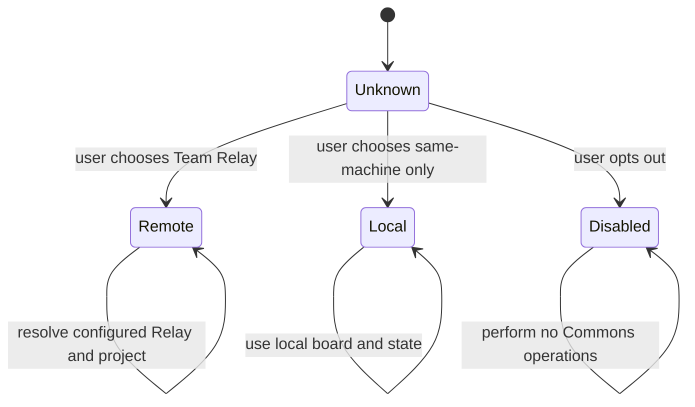
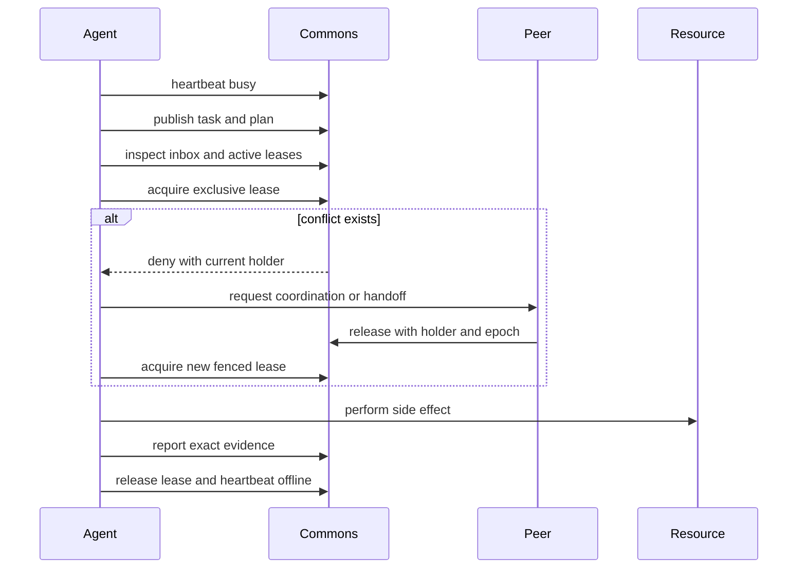

# Architecture

Commons is a coordination control plane beside coding Agent runtimes. It does
not proxy model inference and does not need access to an Agent's hidden
reasoning.

## Components



## Scope Resolution

Scope is the first decision for every workspace:



Unknown scope never implies remote enrollment. The Skill asks the user and
writes the choice through `commons scope enroll`.

## Data Model

The Relay keeps coordination metadata in project-scoped records:

- `projects`: private collaboration scopes inside one Team Relay
- `agents`: session identity, handle, contact code, runtime, heartbeat, and status
- `tasks`: owner, lifecycle, current step, next step, blocker, progress, and version
- `messages`: direct or broadcast communication with durable IDs
- `message_audience` and `message_receipts`: active-at-send broadcast snapshots and per-Agent acknowledgement
- `resources`: canonical shared-resource keys and current fencing epoch
- `leases`: mode, holder, TTL, state, and fencing epoch
- `audit_events`: ordered records for coordination and operational evidence

The local implementation adds plans, artifacts, aliases, and exportable audit
views over the filesystem board and local SQLite state.

## Resource Consistency

Resource IDs use a namespace and canonical target:

```text
deploy-slot:example-app/staging
db:example-app/staging
git-branch:example-app/main
browser-profile:chrome/release
server:example-app/api-1
path:src/payments
```

The Relay normalizes separators, dot segments, case where defined, and trailing
separators. Parent traversal and bare names are rejected.

Write-like lease modes receive a monotonically increasing `fencing_epoch`.
Release requires the registered holder and exact epoch. A downstream protected
system can reject stale operations carrying an older epoch.

## High-Risk Operation Sequence



## Trust Boundaries

### Local mode

Agents run under one developer account and use state under `COMMONS_HOME`.
Local mode is appropriate only when those sessions represent the same user.

### Private Team Relay

One Relay represents one trusted team or organization. Projects separate
coordination views inside that trusted boundary. The current bearer token model
does not provide actor-bound identity or untrusted multi-tenant isolation. A
holder of the shared token is trusted across Relay projects; handles, contact
codes, and Agent IDs remain routing and audit labels rather than authentication
credentials. Authenticated per-Agent sessions are tracked as FH1 roadmap work.

The Console can read every project and message body on its Relay. The default
private Team setup reuses the Team Relay token. A separate Console token is an
optional rotation boundary, not a read-only authorization role.

### Console Query Model

The Console loads a bounded project summary before requesting any collection.
Agents, tasks, broadcasts, direct messages, and leases are fetched only when
their view opens. Collection endpoints use opaque cursors, server-side search
and filters, and a maximum page size of 100 so project growth does not increase
the initial dashboard payload or browser DOM without bound.

The project-scoped read endpoints are:

| Endpoint | Purpose |
| --- | --- |
| `GET /v1/console/projects/{project_id}/summary` | Counts, bounded previews, and recent activity |
| `GET /v1/console/projects/{project_id}/agents` | Paginated Agents with presence and search filters |
| `GET /v1/console/projects/{project_id}/agents/{agent_id}` | Agent profile, active leases, and paginated direct messages |
| `GET /v1/console/projects/{project_id}/tasks` | Paginated tasks with status and search filters |
| `GET /v1/console/projects/{project_id}/broadcasts` | Paginated project broadcasts |
| `GET /v1/console/projects/{project_id}/direct_messages` | Paginated direct messages for operator views |
| `GET /v1/console/projects/{project_id}/leases` | Paginated leases with state and search filters |

Every paginated response includes `page.limit`, `page.has_more`, and an opaque
`page.next_cursor`. A cursor is valid only for the view that issued it. Clients
must discard collection state and cursors when the project, filter, or search
query changes. The legacy unsuffixed project endpoint remains available for
compatible clients, but the browser Console does not use it.

### External systems

Commons coordinates access to Git, deployments, databases, browsers, and
servers, but those systems remain authoritative. Strong enforcement requires a
wrapper, hook, or integration that checks the current lease and fencing epoch.

## Security and Privacy Decisions

- Relay tokens are supplied through environment variables or user-managed
  `0600` files, not stored in `remotes.json`.
- Absolute workspace paths are redacted by default in remote registration.
- The Console exchanges a token for a signed, time-limited, `HttpOnly`,
  `SameSite=Strict` cookie.
- Commons does not require raw prompts, transcripts, model reasoning, browser
  cookies, or application secrets.
- Message content is untrusted input and must not be executed as instructions
  without independent validation.

## Realtime and Failure Behavior

- The Console uses Server-Sent Events for live activity and refreshes from the
  durable Relay state after reconnecting.
- Agent heartbeats are mandatory in the installed Skill. Activity is a recent
  evidence window, not a permanent registration state.
- Leases expire by TTL. Fencing epochs protect integrations from stale holders
  that resume after expiry.
- Inbox pagination reports server caps and completeness instead of silently
  truncating requested history.
- The local filesystem board remains a readable fallback; SQLite owns atomic
  decisions such as lease acquisition.

## Deployment Shapes

### Same machine

```text
Agent sessions -> Commons Skill/CLI -> local SQLite + filesystem board
```

### Private Team

```text
Agent machines -> HTTPS -> Relay -> SQLite
                              -> Console APIs -> static Console
```

The lightweight Relay intentionally starts with Python standard-library HTTP
and SQLite. Advanced organization auth, Postgres, NATS, federation, and public
multi-tenancy are explicit future tracks rather than hidden assumptions.
